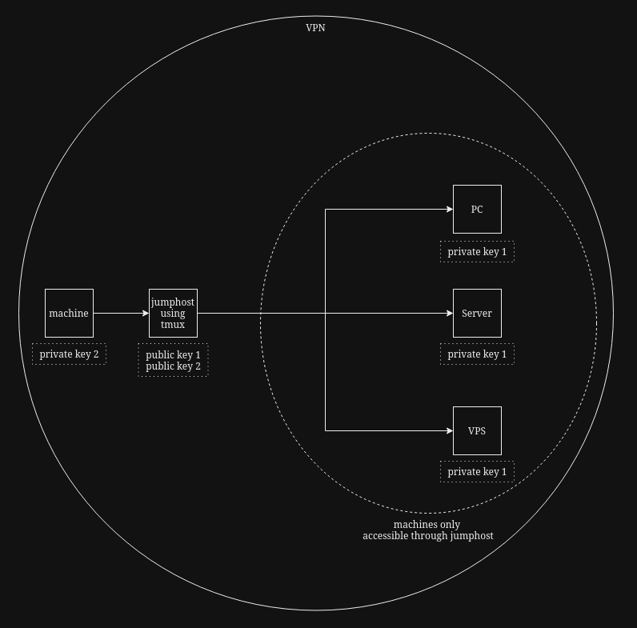

The sshd_config files for each machine I used are included in this folder. They are stored in /etc/ssh on each machine respectively.

My SSH configuration makes use of 2 key pairs. The machines are all hidden behind a VPN, so I have used passwordless SSH keys. From my machine, I connect to the jumphost. From the jumphost, I can connect to the PC, server, and VPS. The SSH keys are organised in such a way that all of the ssh connections can only be initiated in the direction the arrows show. This is to enforce a simple and streamlined setup that limits room for confusion.

This is a basic diagram of my setup:
 

