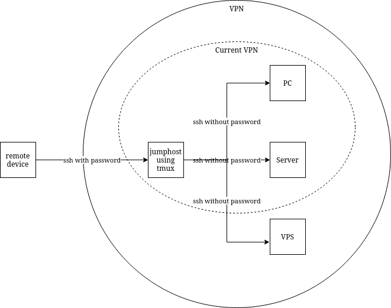

This file makes changes to the default tmux configuration. This file should be located in the home directory of a relevant user (~/.tmux.conf).

### Dependencies
- tmux
- xsel

### Used by
Currently this will be used by whichever machine is being used to connect to the machines inside the VPN.
I intend to set up a jumphost inside the VPN whose sole purpose is to host a tmux session that can connect with the other machines inside the VPN. This machine will always stay on, allowing connections to all other machines be preserved. The remote device connecting to this machine will only have to connect to the jumphost and restore the tmux session if it is restarted or powered off. If the remote machine directly created a tmux session and initiated all connections to other machines, when it is restarted or powered off the tmux session and all connections are lost.

