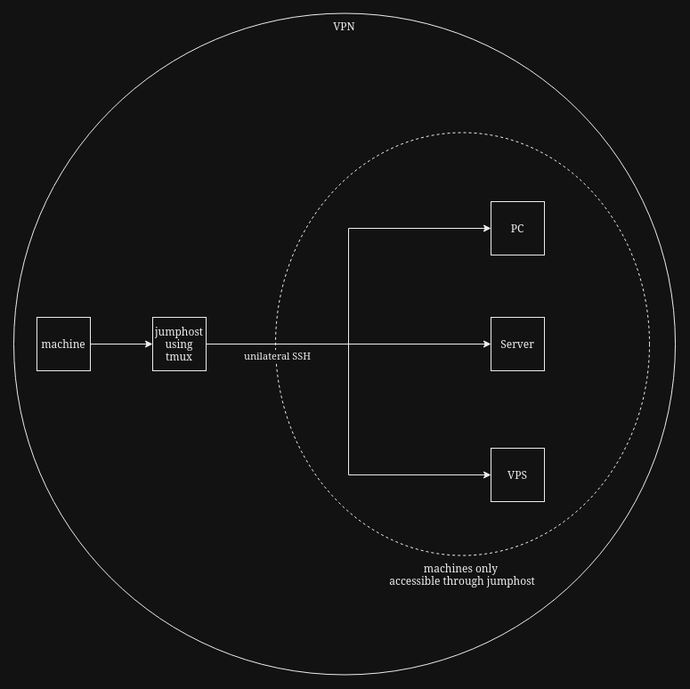

These files (.tmux.conf and .tmux_reset.conf) makes changes to the default tmux configuration, and should be located inside the home directory of the relevant user.

I followed this guide for most of the configuration: https://thevaluable.dev/tmux-config-mouseless/

### Dependencies
- tmux

### Use
Tmux is used by the jumphost. This jumphost is inside the VPN. It can be connected to by any machine in the VPN who has a valid private SSH key. This jumphost can access the PC, server and VPS, with a unilateral SSH connection. A machine inside the VPN can connect to the jumphost and use a tmux session on it. The idea being that if the machine is restarted or powered off and the jumphost is disconnected from, the jumphost itself will preserve the tmux session and any existing SSH connections to other machines. When the machine is up again, it simply needs to connect to the jumphost and resume the session.

This is a diagram of where tmux will be used inside the VPN:

